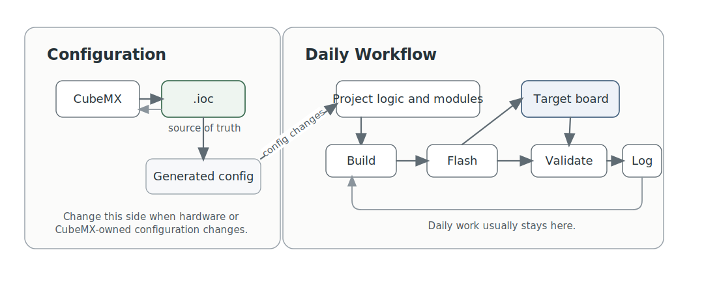

# STM32 AI Flow

STM32 AI Flow is a starter kit for STM32 development teams who want
AI-assisted work to stay reproducible instead of ad hoc.

STM32 AI Flow helps teams use AI for STM32 work without letting build logic,
CubeMX ownership, and validation discipline dissolve into chat history.

This public repository is currently the main public STM32 AI Flow surface. It
publishes the user-facing documentation for the starter kit while the full
working starter repository is still being refined.

Instead of starting every project from scratch, STM32 AI Flow gives a new STM32
repo a clean operating model from day one:

- `.ioc` stays the source of truth for generated configuration
- build, flash, and validation steps stay reproducible
- workflow evidence lives in the repo instead of memory
- later sessions can restart from repo truth instead of reconstructing context

## Why Use It

This is most compelling when you want more than ad-hoc AI help.

What it adds on top of a generic chat-first approach:

- a reproducible `validate -> build -> flash -> verify` loop
- an agent-use rule that repo scripts and checks should be run by the agent
  directly when possible instead of being handed back to the user
- an explicit `.ioc`-first regeneration story instead of fragile memory
- continuity docs so the next session starts from repo truth, not guesswork
- a workflow surface that stays small enough to learn and inspect

## The Fastest Reason To Care

If you want to know whether this is worth trying, the smallest useful proof is
not a long setup exercise.

It is this:

1. create a new STM32 project repo from the starter kit
2. save the board `.ioc`
3. initialize workflow config from that `.ioc`
4. run toolchain, config, and doctor checks once

That is enough to prove something important very early:

- the machine can run the workflow
- the repo has a coherent startup path
- `.ioc` can be made authoritative before the project gets messy

If you want exactly that smallest real first run, start with
`docs/simple-example.md`.

## What This Can Grow Into

The starter kit is intentionally generic, but it is not hypothetical.

The case study in `docs/project-case-study.md` shows this
workflow growing into a real STM32 stepper-control project with:

- interrupt-driven UART command handling and debug output
- stepper pulse generation and motion-control logic
- ADC plus DMA acquisition
- FreeRTOS task orchestration
- a USB binary control path beside the human UART CLI
- a C# desktop operator UI

That example matters because it shows the workflow is not just about generating
files. It can support a real firmware path from early bring-up to a usable host
tool.

## Best Fit

Best fit:

- STM32 projects expected to live longer than a quick experiment
- repos that use CubeMX and need `.ioc` plus generated code to stay coherent
- engineers who want AI help without giving up reproducibility and evidence

Less compelling:

- tiny disposable throwaway tests
- projects that do not want repo-native workflow structure at all
- teams that are not ready to keep `.ioc` authoritative when CubeMX is in use

## Choose Your Path

If you are evaluating STM32 AI Flow for the first time, start from the path
that matches your current goal:

- fastest practical proof on a real board:
  `docs/simple-example.md`
- shortest operator path once the model already makes sense:
  `docs/handbook.md`
- fuller explanation of how the starter kit works and how to adopt it:
  `docs/user-manual.md`
- understanding `.ioc`, CubeMX, and workflow-side configuration boundaries:
  `docs/understanding-ioc-and-cubemx.md`
- adopting the workflow in an existing STM32 repo:
  `docs/migrating-existing-cubeide-cubemx-projects.md`
- seeing what this can grow into beyond board bring-up:
  `docs/project-case-study.md`
- exact manual command mapping:
  `docs/workflow-scripts.md`

## What You Get

The starter kit gives you a practical baseline:

- a prompt-first workflow surface for normal use
- validation, build, flash, and optional serial workflow steps
- a doctor preflight that retries STM32/ST-LINK detection briefly and reports
  last-known hardware context when the current scan is empty
- explicit `validation_policy` gates in workflow config so a starter project
  can make missing flash or serial targets fail early with a clear gate
  message or skip cleanly for hardware-light runs
- HAL module suggestion mode driven from `.ioc`, so the workflow can point out
  likely missing `hal-sync` actions after manual CubeMX reconciliation or
  before build instead of waiting for a missing-driver surprise
- `.ioc` consistency checks that accept valid CubeMX PLL-source alias variants
  instead of warning just because one metadata alias is omitted
- a clear `.ioc`-first story for CubeMX-managed projects
- documentation that explains both how to use the workflow and how to extend it

Flash note:

- the default `flash` stage requires a connected supported programming probe
  visible to STM32CubeProgrammer; in this workflow today that means ST-LINK
  unless a project deliberately adds a different flash path
- some STM32 projects may choose a different flashing backend such as the MCU's
  built-in bootloader over DFU/UART/USB, but that is a project-specific choice
  rather than the default path in this workflow
- when a project wants hardware-light behavior to be explicit, put that choice
  in `validation_policy` inside workflow config rather than relying only on
  ad-hoc skip flags

## Environment Compatibility

This starter kit was developed and tested mainly with VS Code and the Codex
extension. However, it is not tied to any specific editor, agent environment,
or exact model.

It is, however, Windows-first today.

It should work in other agent environments if they can:

- read repository files
- run PowerShell or equivalent shell commands
- edit files in the repo
- follow repo-native instructions

The current starter-kit implementation is tested under Windows and still makes
several Windows-specific assumptions:

- prerequisite installation uses `winget`
- tool discovery checks ST default install paths such as `C:\ST\...`
- board and serial discovery use Windows device queries
- many examples assume `COMx` naming
- styled PDF export currently uses Microsoft Edge

Linux and macOS are realistic targets for the build-oriented core, but they are
not yet first-class environments for the full workflow.

This implementation is designed for STM32 today, with STM32CubeMX and `.ioc`
as the current configuration source-of-truth path.

The underlying workflow ideas are more general:

- one clear configuration authority
- one reproducible build/flash/validate loop
- repo-native continuity between sessions
- honest reporting about what passed, failed, or was skipped

In practice, adapting the same approach to another microcontroller family would
mean replacing the STM32-specific generation, toolchain, and validation layer
with equivalents for that ecosystem. Portability is easiest when the target
platform has a stable project/configuration artifact comparable to STM32
`.ioc`.

## Why Use A Seed Like This

Most STM32 projects start with the same problems:

- environment setup is inconsistent
- build and flash steps live in tribal memory
- `.ioc` and source code drift apart
- onboarding takes longer than it should

This starter kit is designed to make those problems smaller on day one.

## Why Not Just Use A Generic AI Chat

You can absolutely build an STM32 project with a generic AI assistant and no
starter kit.

What tends to go missing in that model is not coding ability. It is the
surrounding discipline:

- where workflow evidence is written
- how `.ioc` stays aligned with generated code
- how a new session rebuilds context
- how "build passed" is kept separate from broader workflow success

The starter kit is meant to make those rules explicit instead of rediscovering
them prompt by prompt.

## The First Useful Ten Minutes

If you want the fastest proof that this starter kit is worth trying, do only
this first:

1. get access to the STM32 AI Flow starter kit or a repo created from it
2. save the new project's `.ioc`
3. initialize workflow config from that `.ioc`
4. run toolchain, config, and doctor checks

That first pass is enough to prove that:

- the machine can run the workflow
- the new repo has a coherent startup path
- `.ioc` can become the source of truth cleanly before product code grows

If you need exact command mapping, use `docs/workflow-scripts.md`.

## Need Help Using It

If you are trying this workflow and want help using it or adapting it to a real
STM32 project, open a GitHub Discussion in this repository.

If you want early access to the full working starter kit while the public
surface is still documentation-first, ask there as well.

## Where To Read Next

Start with one of these depending on your goal:

- `docs/simple-example.md` for the fastest concrete first success
- `docs/handbook.md` for the shortest practical operating path
- `docs/user-manual.md` for fuller explanation and onboarding
- `docs/understanding-ioc-and-cubemx.md` for `.ioc` and CubeMX ownership
- `docs/migrating-existing-cubeide-cubemx-projects.md` for existing repos
- `docs/project-case-study.md` for a larger growth story
- `docs/workflow-safety.md` for trusted-input and high-risk-action policy

Reading copies:

- `docs/pdf/user-manual.pdf`
- `docs/pdf/handbook.pdf`
- `docs/pdf/agent-communication-guide.pdf`
- `docs/pdf/simple-example.pdf`
- `docs/pdf/project-case-study.pdf`
- `docs/pdf/workflow-safety.pdf`
- `docs/html/user-manual.html`
- `docs/html/handbook.html`
- `docs/html/agent-communication-guide.html`
- `docs/html/simple-example.html`
- `docs/html/project-case-study.html`
- `docs/html/workflow-safety.html`

## License And Marks

This public docs export carries:

- `LICENSE`
- `NOTICE`
- `TRADEMARKS.md`

Use those files as the source of truth for reuse and mark-use guidance in the
exported public repository.
