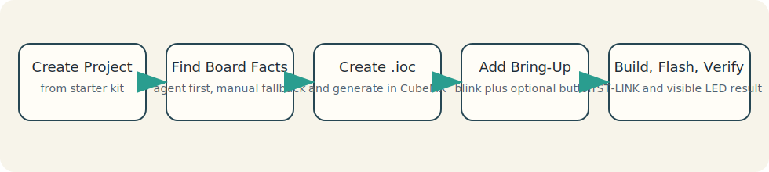

# STM32 AI Flow Simple Example

This is the recommended first hands-on scenario for a new STM32 project
created from the starter kit.

Use it to take a real board, create a real `.ioc`, generate a real STM32
project, and reach one visible result:

- the user LED blinks
- optionally, the user button changes the blink rate

For a larger real-project growth example, use `docs/user/project-case-study.md`.

## Example Flow



## Before Phase 1: Check Prerequisites

Do this before creating the project or opening STM32CubeMX.

Use `docs/user/prerequisites.md` for the actual prerequisite list and installation
guidance.

Recommended prompt:

```text
Check whether this machine has the prerequisites required for the STM32 AI Flow starter kit.
Use `docs/user/prerequisites.md` as the reference,
tell me what is already installed,
what is missing,
and what still needs to be configured before I start the simple example.
```

## Phase 1: Create the Project from the Starter Kit

Create a normal project from the public starter repo.

Recommended prompt:

```text
Create a normal production project from the public starter.
Project name: <NAME>
Target root: <PATH>
Workflow mode: vendored
```

After creation, the new repo should already contain the workflow layer,
including:

- `AGENTS.md`
- `README.md`
- `scripts/`
- `skills/`
- `.github/`
- workflow docs under `docs/`

At this stage, a new STM32 project usually does not yet have generated
`Core/`, `Drivers/`, or a real `.ioc`.

## Phase 2: Determine Board Facts

### Recommended Path: Let the Agent Search First

Start by asking the agent to identify the board facts from official ST sources.

Recommended prompt:

```text
I have a NUCLEO-<MODEL> board. Find the board facts from official ST sources:
MCU, user LED pin, user button pin, whether ST-LINK is present, and the recommended flashing path.
First show the findings briefly, cite the sources, and flag any uncertainty.
Do not generate anything until I confirm the board facts.
```

Expected result:

```text
Board: NUCLEO-...
MCU: STM32...
User LED: GPIOx Pin y
User Button: GPIOx Pin y
Flash path: ST-LINK
Notes: ...
```

### Fallback Path: Enter Board Facts Manually

If the lookup is incomplete or uncertain, provide the board facts manually.

Recommended prompt:

```text
The board facts could not be determined reliably automatically.
Use these board facts manually:
Board: NUCLEO-<MODEL>
MCU: STM32...
LED: GPIOx Pin y
Button: GPIOx Pin y
Flash path: ST-LINK
Keep these facts as the basis for the next step and prepare the CubeMX guidance.
```

## Phase 3: Create the Real `.ioc` in STM32CubeMX

Use the confirmed board facts to create the STM32CubeMX project.

Recommended prompt:

```text
The board facts are confirmed. Suggest the minimal STM32CubeMX setup
for a bring-up project with LED blink and a button for the NUCLEO-<MODEL> board.
Describe only the practical steps needed for this bring-up:
board selection,
LED and button check,
toolchain/project generation settings,
and code generation.
```

In STM32CubeMX:

1. Open STM32CubeMX and select your exact Nucleo board.
2. Check which pins are assigned to the user LED and the user button.
3. Most likely the LED GPIO and the Button GPIO are already configured correctly.
4. If one of them is not configured as expected, fix only that GPIO assignment.
5. Keep the board's working clock configuration unless you have a reason to change it.
6. In `Project Manager`, set `Toolchain / IDE` to `CMake`.
7. Save the `.ioc` in the project repo.
8. Generate code.

After generation, the repo should now contain:

- a real `.ioc`
- `Core/`
- `Drivers/`
- the normal STM32 generated tree

## Phase 4: Initialize the Workflow Against the Real `.ioc`

After the `.ioc` exists, initialize and validate the workflow.

Recommended prompt:

```text
The `.ioc` now exists in the repo.
Initialize the workflow from this `.ioc`,
then run the toolchain, config, and doctor checks,
and summarize anything I should review before writing application code.
```

After CubeMX code generation, ask the agent to check that the generated files
and the workflow state are still aligned.

Recommended prompt:

```text
The code was generated in STM32CubeMX.
Check that the generated files are aligned with the workflow rules
and tell me whether the generated tree is aligned now.
```

If you need the exact wrapper commands behind this step, use
`docs/reference/workflow-scripts.md`.

## Phase 5: Add the Minimal Bring-Up Logic

Keep `main.c` minimal and move behavior into small modules.

After you ask the agent to add the first bring-up functionality, a small first
set of project-owned files can be:

```text
Core/
  Inc/
    app.h
    blink.h
    board_profile.h
  Src/
    app.c
    blink.c
    main.c
```

Recommended prompt:

```text
The project was already created from the starter kit, and the `.ioc` was generated in CubeMX.
Now add the minimal bring-up:
make the user LED blink with a 500 ms period,
and when the user button is pressed, change the blink period to 200 ms.
Keep `main.c` minimal, do not break the generated sections,
and move the logic into separate modules.
```

## Phase 6: Build and Flash

After the minimal bring-up logic is added, build and flash.

Recommended prompt:

```text
Build the project, flash the board, and summarize the result.
State clearly what passed, what was skipped, and what still depends on hardware validation.
```

If you want the agent to run the broader default workflow instead of only
build plus flash:

```text
Run the normal development workflow for this project
and summarize the result honestly.
```

## Phase 7: Verify the Result

Expected observable behavior:

- the user LED blinks with a 500 ms period
- when the user button is pressed, the blink period changes to 200 ms

Recommended prompt:

```text
The build and flash steps are complete. Record the minimal bring-up result:
what should be observed on the board,
which checks already passed,
and what still remains unverified without additional hardware or measurements.
```

## Quick Prompt Set

### 1. Board Fact Lookup

```text
I have a NUCLEO-<MODEL> board. Find the board facts from official ST sources:
MCU, user LED pin, user button pin, whether ST-LINK is present, and the recommended flashing path.
First show the findings briefly, cite the sources, and flag any uncertainty.
Do not generate anything until I confirm the board facts.
```

### 2. Manual Board Fact Fallback

```text
The board facts could not be determined reliably automatically.
Use these board facts manually:
Board: NUCLEO-<MODEL>
MCU: STM32...
LED: GPIOx Pin y
Button: GPIOx Pin y
Flash path: ST-LINK
Prepare the next step for CubeMX.
```

### 3. CubeMX Setup Guidance

```text
The board facts are confirmed. Suggest the minimal STM32CubeMX setup
for a bring-up project with LED blink and a button.
Describe only the required practical steps.
```

### 4. Post-Generation Minimal App

```text
The `.ioc` already exists and the code was generated from CubeMX.
Now add the minimal bring-up:
LED blink and a button to change the blink rate.
Keep `main.c` thin and move the logic into separate modules.
```

### 5. Result Recording

```text
Record the result of the first bring-up:
what is already confirmed,
what is not yet confirmed,
and which next minimal steps are needed.
```

